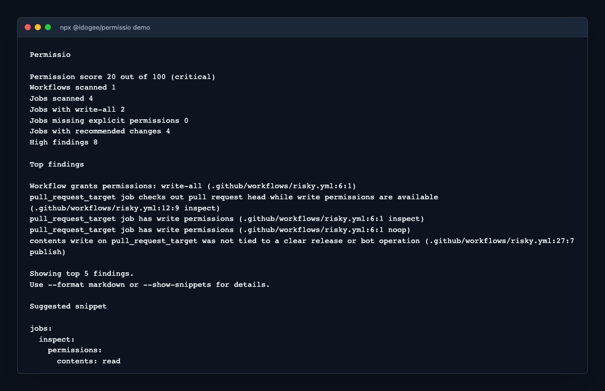

# Permissio

[](https://www.npmjs.com/package/@idogee/permissio)
[](https://github.com/iDogRoag/permissio/actions/workflows/ci.yml)
[](LICENSE)

Find overprivileged GitHub Actions tokens before they become an invisible part of your CI/CD attack surface.

Permissio scans `.github/workflows` and recommends the smallest likely `GITHUB_TOKEN` permissions for each job.
It reports exact YAML locations, emits GitHub-compatible SARIF, and provides copy-paste least-privilege settings.



```sh
npx @idogee/permissio check .
```

```sh
npx @idogee/permissio demo
```

```txt
Permissio

Permission score 20 out of 100 (critical)
Workflows scanned 1
Jobs scanned 4
Jobs with write-all 2
Jobs missing explicit permissions 0
Jobs with recommended changes 4
High findings 8

Top findings

Workflow grants permissions: write-all (.github/workflows/risky.yml:6:1)
pull_request_target job checks out pull request head while write permissions are available
pull_request_target job has write permissions
contents write on pull_request_target was not tied to a clear release or bot operation
id-token write was declared but no OIDC, cloud auth, or attestation use was detected

Suggested snippet

jobs:
  test:
    permissions:
      contents: read
```

```sh
npx @idogee/permissio demo --format html --output permissio-demo.html
```

Preview the demo output:

- Terminal output: [docs/assets/demo-output.txt](docs/assets/demo-output.txt)
- Markdown report: [docs/assets/demo-output.md](docs/assets/demo-output.md)
- HTML report: [docs/assets/demo-report.html](docs/assets/demo-report.html)

## What is Permissio

Permissio is a focused static analyzer for GitHub Actions `GITHUB_TOKEN` permissions.
It scans workflow YAML and recommends explicit job-level `permissions` blocks such as `contents: read`, `pages: write`, `id-token: write`, or `permissions: {}`.

Permissio is not a full GitHub Actions security scanner, and it does not prove that a workflow is safe.

## Why this exists

Many GitHub Actions workflows still rely on implicit token defaults, `read-all`, `write-all`, or workflow-level write permissions when only one job needs them.
Those broad defaults make CI/CD permissions harder to review.

Permissio helps teams review and reduce the token permissions available to each job.

## Quickstart

```sh
npx @idogee/permissio check .
```

Common options:

```sh
permissio check --show-snippets
permissio check --format markdown
permissio check --format json
permissio check --format html --output permissio-report.html
permissio check --format sarif --output permissio.sarif
permissio check --badge
permissio check --fail-on high
```

## Demo

The demo command scans a bundled risky example, so you can try Permissio before pointing it at a repo.

```sh
npx @idogee/permissio demo
npx @idogee/permissio demo --format markdown
npx @idogee/permissio demo --format json
npx @idogee/permissio demo --format html --output permissio-demo.html
npx @idogee/permissio demo --format sarif
npx @idogee/permissio demo --show-snippets
npx @idogee/permissio demo --badge
```

Demo assets:

- [Terminal output](docs/assets/demo-output.txt)
- [Markdown output](docs/assets/demo-output.md)
- [HTML report](docs/assets/demo-report.html)

## Example output

```txt
Permissio

Permission score 20 out of 100 (critical)
Workflows scanned 1
Jobs scanned 4
Jobs with write-all 2
Jobs missing explicit permissions 0
Jobs with recommended changes 4
High findings 8

Top findings

Workflow grants permissions: write-all (.github/workflows/risky.yml:6:1)
pull_request_target job checks out pull request head while write permissions are available
pull_request_target job has write permissions
contents write on pull_request_target was not tied to a clear release or bot operation
id-token write was declared but no OIDC, cloud auth, or attestation use was detected

Suggested snippet

jobs:
  test:
    permissions:
      contents: read
```

## What it detects

Permissio uses deterministic static rules for common GitHub Actions permission needs. See [docs/rules.md](docs/rules.md) for the full rule reference.

- `actions/checkout` -> `contents: read`
- GitHub Pages deployment -> `pages: write`, `id-token: write`
- artifact attestations -> `attestations: write`, `artifact-metadata: write`, `id-token: write`, `contents: read`
- OIDC cloud authentication -> `id-token: write`
- GitHub Packages and `ghcr.io` publishing -> `packages: write`
- release creation or asset upload -> `contents: write`
- issue and pull request writes -> `issues: write` or `pull-requests: write`
- checks, statuses, deployments, security events, actions, discussions, models, and vulnerability alert reads
- risky `pull_request_target` permission patterns
- broad `write-all`, broad `read-all`, implicit permissions, unknown scopes, and unknown third-party actions

## How recommendations work

Permissio infers the smallest likely permission set from workflow structure, known actions, and recognizable command patterns.
Recommendations are conservative and explainable: every inferred permission includes a reason and evidence.

When no `GITHUB_TOKEN` permission appears necessary, Permissio recommends:

```yaml
permissions: {}
```

Review every recommendation before applying it, especially for complex scripts or third-party actions.

## GitHub Actions usage

```yaml
name: Check GitHub Actions permissions

on:
  pull_request:
  push:
    branches:
      - main

permissions:
  contents: read

jobs:
  permissio:
    runs-on: ubuntu-latest
    steps:
      - uses: actions/checkout@v6
      - uses: actions/setup-node@v6
        with:
          node-version: 24
      - run: npx @idogee/permissio check . --ci --format markdown --output permissio-report.md --fail-on high
```

To upload findings to GitHub code scanning, emit SARIF and upload it:

```yaml
name: Check GitHub Actions permissions

on:
  pull_request:
  push:
    branches:
      - main

permissions:
  contents: read
  security-events: write

jobs:
  permissio:
    runs-on: ubuntu-latest
    steps:
      - uses: actions/checkout@v6
      - uses: actions/setup-node@v6
        with:
          node-version: 24
      - run: npx @idogee/permissio check . --ci --format sarif --output permissio.sarif --fail-on high
      - uses: github/codeql-action/upload-sarif@v4
        if: always()
        with:
          sarif_file: permissio.sarif
```

## How Permissio is different

zizmor is a GitHub Actions security linter.
StepSecurity Harden Runner focuses on runtime hardening and egress control.
Permissio is a focused static analyzer for GITHUB_TOKEN permissions.

Use them together.

## Install

The npm package is `@idogee/permissio`.
The CLI binary remains `permissio`.
Permissio requires Node.js 22.13 or newer; Node.js 24 LTS is recommended. CI also tests the current Node.js 26 release.

For one-off runs without a local or global install:

```sh
npx @idogee/permissio check .
npx @idogee/permissio demo
```

For a local dev dependency:

```sh
npm install --save-dev @idogee/permissio
npx permissio check .
```

For a global install:

```sh
npm install -g @idogee/permissio
permissio check .
```

For local development:

```sh
git clone https://github.com/iDogRoag/permissio.git
cd permissio
npm install
npm run build
```

## Configuration

Permissio scans `.github/workflows/*.{yml,yaml}` by default.
Use `--include` to add extra workflow globs:

```sh
permissio check . --include "examples/**/*.yml"
```

Exit codes:

- `0`: scan completed and the selected fail policy did not trigger
- `1`: findings triggered `--fail-on high` or `--fail-on changes`
- `2`: internal error, invalid CLI input, or unreadable workflow file

If no workflows are found, Permissio exits `0` by default and suggests `permissio demo`.

## Report formats

```sh
permissio check --format table
permissio check --format markdown
permissio check --format json
permissio check --format html --output permissio-report.html
permissio check --format sarif --output permissio.sarif
```

JSON output includes a stable top-level `schemaVersion`, `summary`, `score`, `workflows`, and `findings`.
Each finding includes `id`, `category`, `severity`, `message`, and an exact YAML source location when available.

SARIF output uses SARIF 2.1.0 and can be uploaded to GitHub code scanning. Findings point to the relevant permission, job, trigger, or step line.

Permissio can print badge Markdown, but it does not host badges in v1.

```sh
permissio check --badge
```

## Permission score

The permission score is a heuristic from `0` to `100`, not proof of safety.
It starts at `100` and subtracts points for broad or risky permission patterns.
If any workflow cannot be parsed, the score status is `incomplete` and human-readable reports show the score as unavailable instead of presenting a misleading safety grade.

Labels:

- `90` to `100`: strong
- `70` to `89`: good
- `50` to `69`: risky
- `0` to `49`: critical

JSON output includes:

```json
{
  "score": {
    "value": 54,
    "label": "risky",
    "status": "complete",
    "penalties": []
  }
}
```

With `--badge`, JSON also includes:

```json
{
  "badge": {
    "markdown": "",
    "label": "permissio 54/100",
    "color": "orange"
  }
}
```

## Security model

Permissio is offline and read-only.
It does not call the GitHub API by default, require credentials, execute workflows, run shell scripts, or modify files.

## Limitations

Because Permissio uses static analysis, it may miss behavior hidden inside complex shell scripts, remote reusable workflows, organization settings, or third-party actions it does not recognize.
It intentionally does not try to model repository or organization default token settings.

## Roadmap

- Autofix mode
- PR comment mode
- GitHub App
- Organization-wide scan
- Integration with gha-bom
- Integration with zizmor output
- More third-party action permission rules
- Reusable workflow permission analysis
- VS Code extension
- Hosted badge service

## Contributing

Issues and pull requests are welcome. New rules should be deterministic, explainable, and covered by fixtures.

## Good first contributions

- Add a new permission inference rule
- Improve `pull_request_target` detection
- Add fixtures for real world workflows
- Improve Markdown report formatting
- Add detection for another release action
- Add tests for unusual YAML forms

## License

MIT
